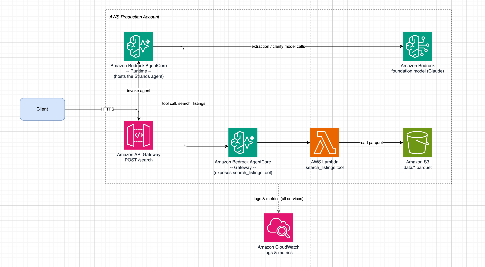

# Agentic Natural-language Car Search

Natural-language car search: turn a free-text query (e.g. *"reliable family
SUV under $30k, low mileage, near Chicago"*) into structured search filters
via an LLM agent, deterministically filter the **entire real car
inventory** (~22k listings across `data/*.parquet`) against them via SQL,
and return the top matches with a grounded explanation. Runs entirely
locally — no database server, no deployment, no auth.

## Setup

Requires Python 3.11+ and [`uv`](https://docs.astral.sh/uv/).

```bash
uv sync
```

Set your Anthropic API key (the only required piece of configuration) —
either export it, or put it in a `.env` file at the repo root (loaded
automatically):

```bash
export ANTHROPIC_API_KEY=sk-ant-...
```

If the key is missing entirely, you get a clear `ANTHROPIC_API_KEY is not
set` error rather than a raw SDK stack trace. See `.env` for the full list
of optional overrides (model ID, max tokens, host/port).

## Running the API locally

```bash
uv run car-search
# or: uv run uvicorn car_search.api.server:app --reload
```

Then, from another terminal:

```bash
curl -s -X POST http://127.0.0.1:8000/search \
  -H "Content-Type: application/json" \
  -d '{"query": "reliable family SUV under $30k, low mileage, near Detroit"}' | python3 -m json.tool
```

Sample response:

```json
{
    "filters": {
        "make": null,
        "model": null,
        "body_type": "SUV",
        "price_max": 30000.0,
        "mileage_max": 50000,
        "year_min": null,
        "fuel_type": null,
        "location": "Detroit",
        "radius_mi": null
    },
    "results": [
        {
            "id": "784435335",
            "make": "Jeep",
            "model": "Commander",
            "body_type": "SUV",
            "price": 7465.0,
            "mileage": 4337,
            "year": 2007,
            "fuel_type": "Gasoline",
            "city": "Saint Clair",
            "state": "MI",
            "zip": "48079"
        },
        {
            "id": "784584884",
            "make": "Ford",
            "model": "Escape",
            "body_type": "SUV",
            "price": 15620.0,
            "mileage": 44849,
            "year": 2018,
            "fuel_type": "Gasoline",
            "city": "Sterling Heights",
            "state": "MI",
            "zip": "48313"
        },
        {
            "id": "785845728",
            "make": "Jeep",
            "model": "Wrangler",
            "body_type": "SUV",
            "price": 17990.0,
            "mileage": 33290,
            "year": 2006,
            "fuel_type": "Gasoline",
            "city": "Monroe",
            "state": "MI",
            "zip": "48161"
        },
        {
            "id": "783892345",
            "make": "Jeep",
            "model": "Compass",
            "body_type": "SUV",
            "price": 19650.0,
            "mileage": 48948,
            "year": 2019,
            "fuel_type": "Gasoline",
            "city": "White Lake",
            "state": "MI",
            "zip": "48383"
        },
        {
            "id": "784017498",
            "make": "Ford",
            "model": "Escape",
            "body_type": "SUV",
            "price": 20480.0,
            "mileage": 33629,
            "year": 2020,
            "fuel_type": "Gasoline",
            "city": "Plymouth",
            "state": "MI",
            "zip": "48170"
        }
    ],
    "explanation": "Found 5 listings matching SUV, under 50,000 mi, under $30,000, near Detroit.",
    "relaxed_fields": null,
    "clarifying_question": null
}
```

A malformed request (missing/empty `query`) returns a `4xx`. If a query is
too vague to search meaningfully (e.g. `"find me a car"`), the response
instead sets `clarifying_question` and returns no results.

## Running tests / typecheck / lint

```bash
uv run pytest      # unit tests only, no network calls required
uv run mypy         # strict typecheck (src, scripts, tests)
uv run ruff check .
```

## Running the golden-set eval

```bash
uv run python scripts/eval_golden_set.py [--strict]
```

Runs a 12-query hand-written golden set (`src/car_search/data/golden_set.json`)
through the real extraction step (this hits the live Anthropic API) and
prints a per-field precision/recall/F1 table plus contradiction- and
clarify-triggering behavior checks. `--strict` exits non-zero if the score
or a behavior check falls short — useful for CI.

## Architecture



Built with [AWS Strands Agents](https://strandsagents.com/) for
orchestration, the Anthropic API as the model provider, and
[DuckDB](https://duckdb.org/) for out-of-core querying of the full dataset
(no need to hold it all in memory).

- Diagram sources (Mermaid + draw.io) and per-diagram legends: `docs/diagrams/`
- Full package layout: `docs/layout.md`
- Data-shape decisions (price, location, fixtures): `docs/data.md`
